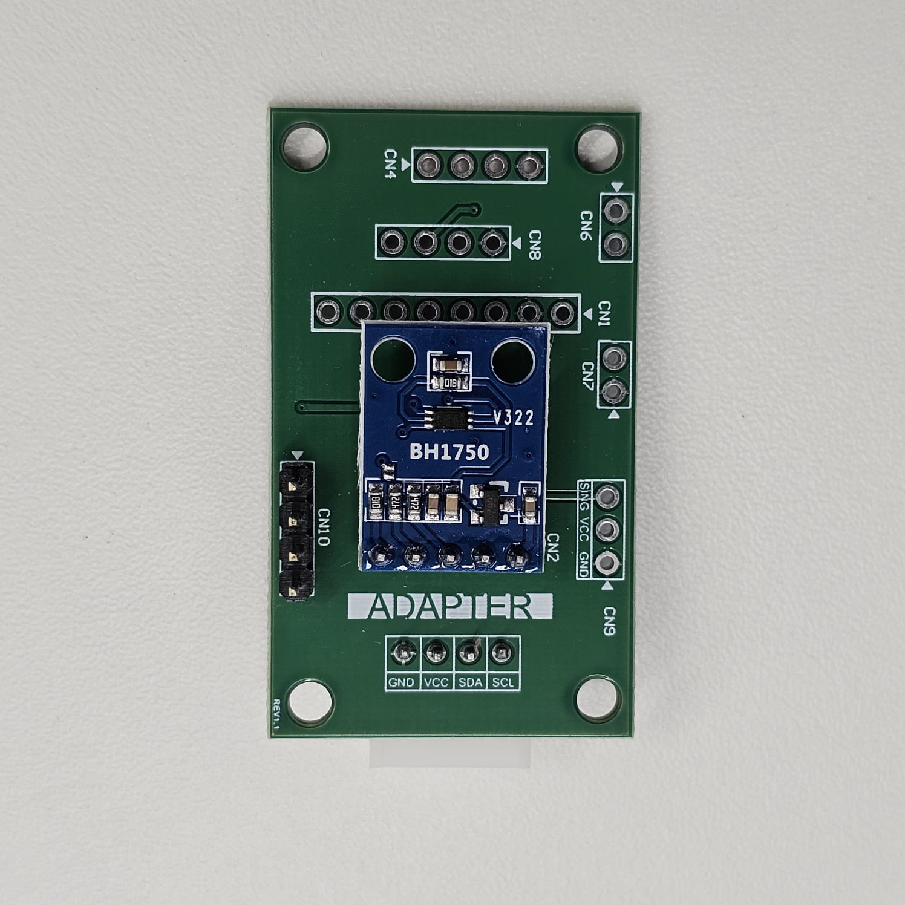
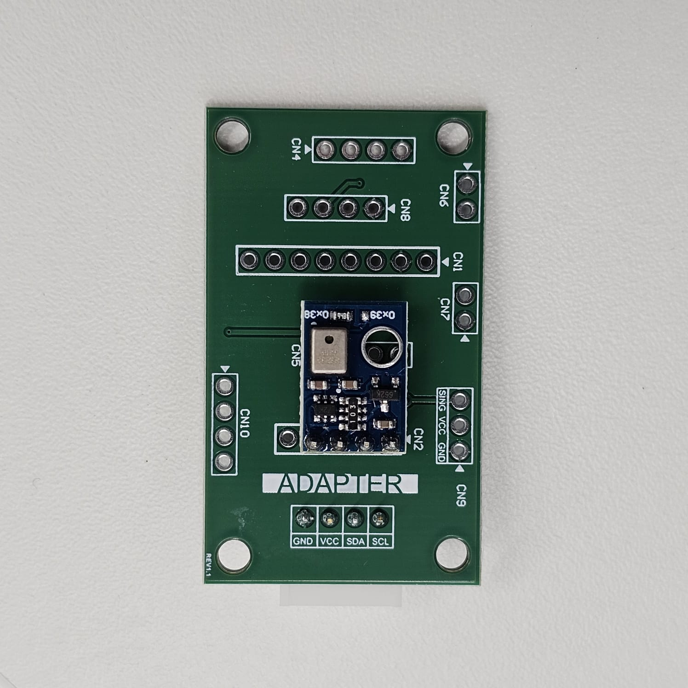
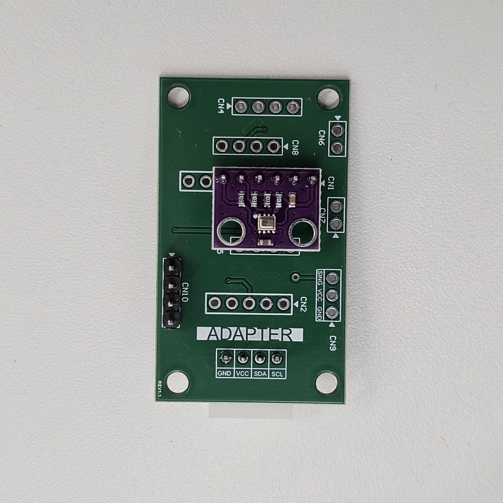
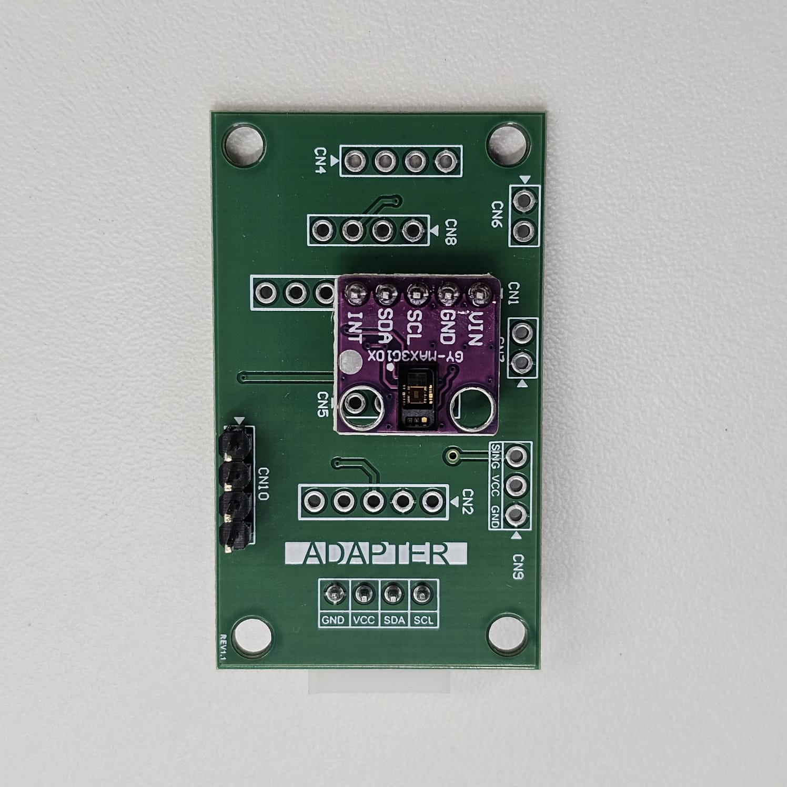
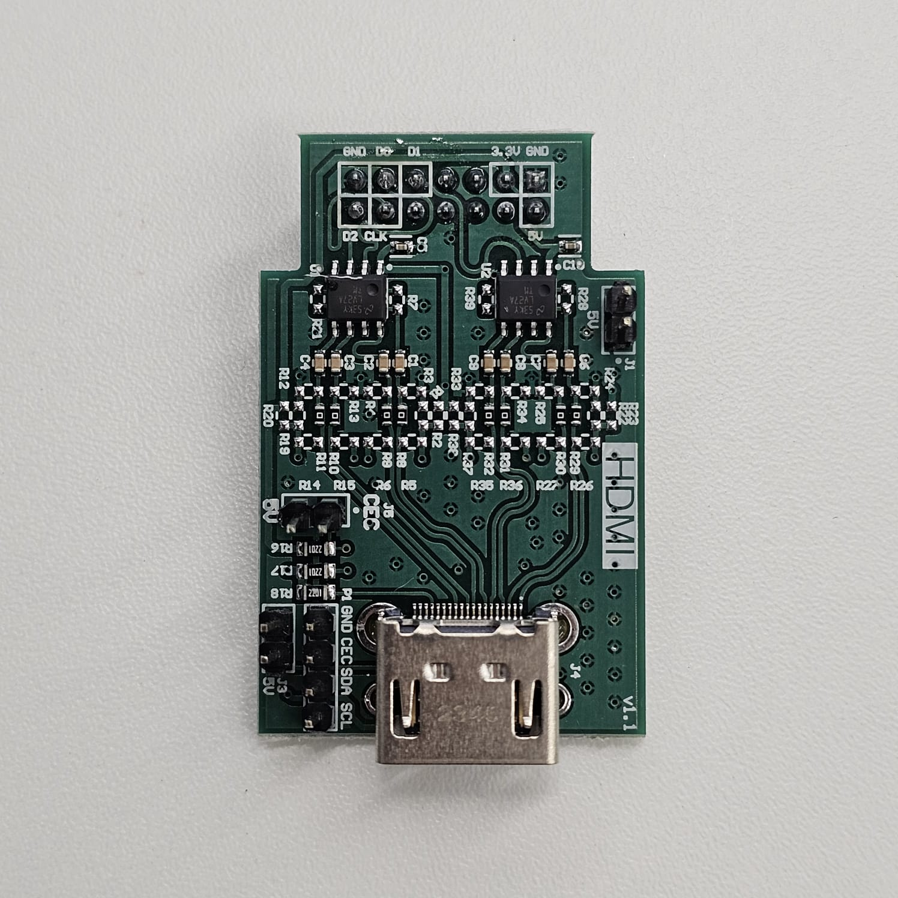
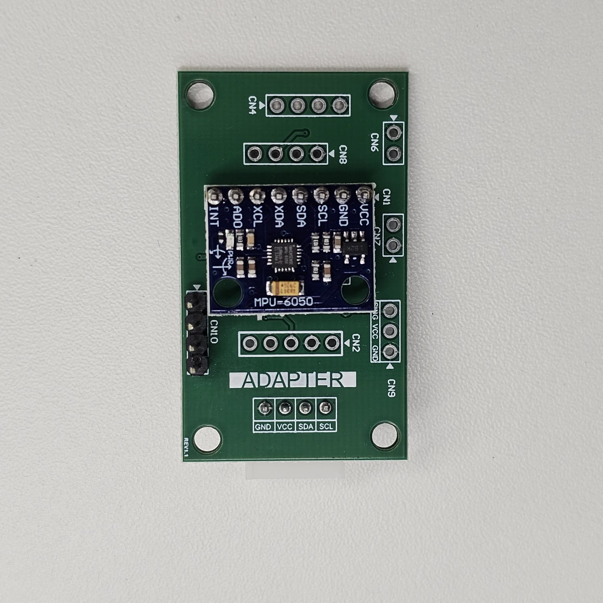
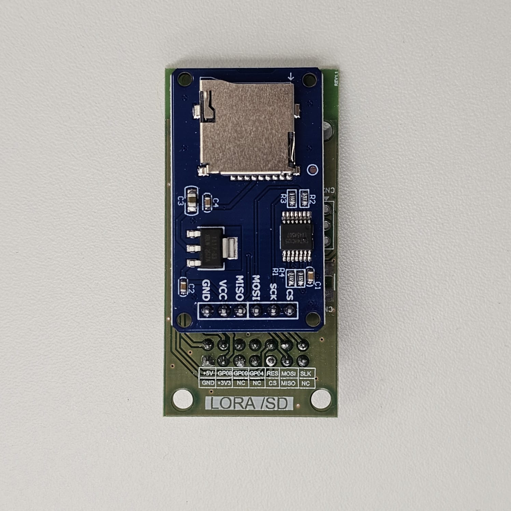
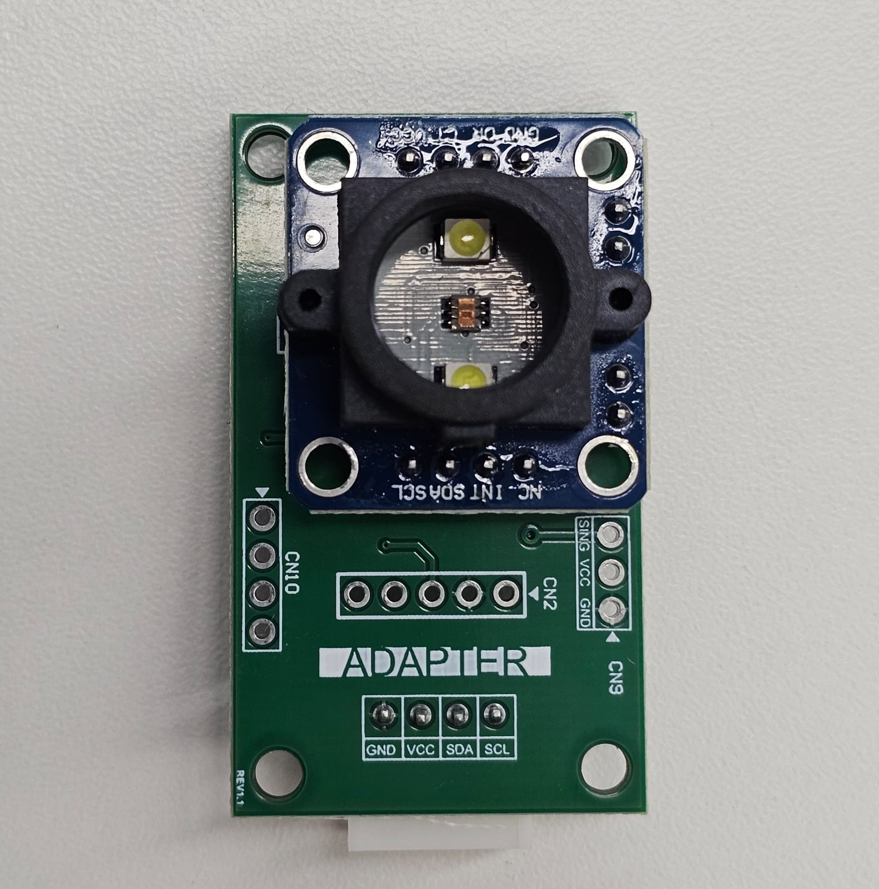
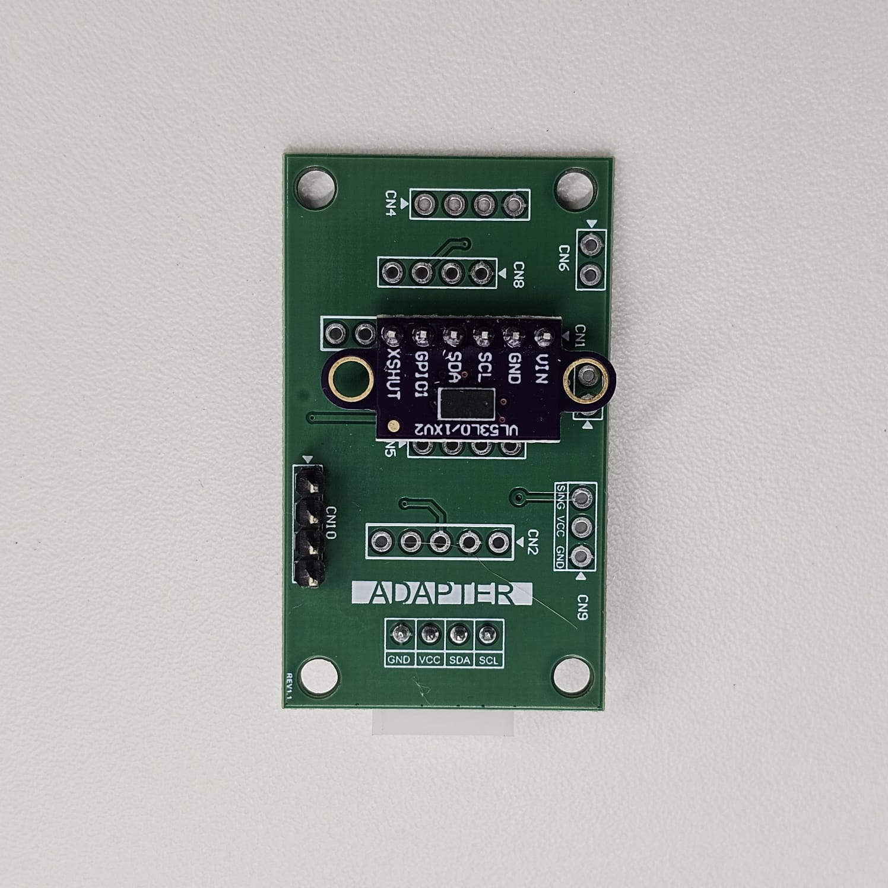

# Repositório de Drivers Raspberry Pi Pico W

Esse repositório de drivers foi criado visando facilitar o uso do Kit de sensores, atuadores e perifericos fornecido ao longo da residencia tecnológica do Embarcatech 2025.

Sinta-se a vontade para colaborar aprimorando drivers ou criando novos.

## Lista de Drivers

<table>
  <tr>
    <th>Referência</th>
    <th>Modelo</th>
    <th>Status</th>
    <th>Driver</th>
  </tr>
  <tr>
  <th></th>
  <th>BH1750</th>
  <th>✅ Concluído</th>
  <th><a href="https://github.com/joao-tolomelli/pico-w-drivers/tree/main/BH1750">BH1750</a></th>
</tr>
<tr>
  <th></th>
  <th>BME280</th>
  <th>❌ Não iniciado</th>
  <th><a href="https://github.com/joao-tolomelli/pico-w-drivers/tree/main/BME280">BME280</a></th>
</tr>
<tr>
  <th></th>
  <th>AHT10</th>
  <th>❌ Não iniciado</th>
  <th><a href="https://github.com/joao-tolomelli/pico-w-drivers/tree/main/AHT10">AHT10</a></th>
</tr>
<tr>
  <th></th>
  <th>GY-MAX3G1OX</th>
  <th>⚠️ Parcialmente funcional</th>
  <th><a href="https://github.com/joao-tolomelli/pico-w-drivers/tree/main/GY-MAX3G1OX">GY-MAX3G1OX</a/></th>
</tr>
<tr>
  <th></th>
  <th>HDMI</th>
  <th>❌ Não iniciado</th>
  <th><a href="https://github.com/joao-tolomelli/pico-w-drivers/tree/main/HDMI">HDMI</a></th>
</tr>
<tr>
  <th></th>
  <th>MPU6050</th>
  <th>✅ Concluído</th>
  <th><a href="https://github.com/joao-tolomelli/pico-w-drivers/tree/main/MPU6050">MPU6050</a></th>
</tr>
<tr>
  <th></th>
  <th>SD-CARD</th>
  <th>❌ Não iniciado</th>
  <th><a href="https://github.com/joao-tolomelli/pico-w-drivers/tree/main/SD-CARD">SD-CARD</a></th>
</tr>
<tr>
  <th></th>
  <th>TCS34725</th>
  <th>✅ Concluído</th>
  <th><a href="https://github.com/joao-tolomelli/pico-w-drivers/tree/main/TCS34725">TCS34725</a/></th>
</tr>
<tr>
  <th></th>
  <th>VL53L0X</th>
  <th>✅ Concluído</th>
  <th><a href="https://github.com/joao-tolomelli/pico-w-drivers/tree/main/VL53l0X">VL53L0X</a></th>
</tr>
</table>
